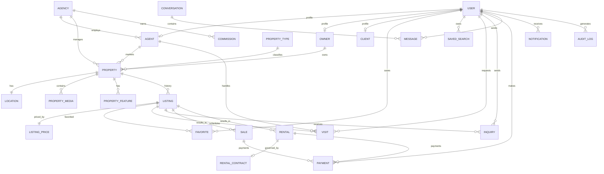

# Modèle de données — Immo-MyKajy

Le schéma source est [`backend/prisma/schema.prisma`](../backend/prisma/schema.prisma). Toutes les clés primaires sont des UUID générés par Prisma. Les modèles `Agent`, `Owner` et `Client` correspondent aux profils spécialisés d'un `User`; ils conservent les tables historiques `AgentProfile`, `OwnerProfile` et `ClientProfile` grâce à `@@map`.

## Diagramme logique



## Relations, intégrité et enums

- `Property` est le bien physique; `Listing` est une annonce. Un `Property` possède donc plusieurs `Listing` afin de préserver l'historique de publication. Chaque annonce porte `transactionType` (`SALE` ou `RENT`), `status`, `visibility`, dates de publication et un unique `ListingPrice`.
- Les profils `Agent`, `Owner` et `Client` sont en 1–1 avec `User` (`userId @unique`). `Agent` est aussi rattaché à une `Agency`.
- `Visit` et `Inquiry` concernent une annonce précise; `Sale` et `Rental` en sont les transactions. Un `Rental` peut avoir au plus un `RentalContract`.
- Les favoris sont uniques par couple utilisateur/annonce (`@@unique([userId, listingId])`). Les participants de conversation sont uniques par couple conversation/utilisateur.
- Les enums couvrent les rôles, genre, transaction, états du bien/de l'annonce/de visite/de demande/de vente/de location/de contrat/de paiement/de commission, méthode de paiement, type média, type de notification et action d'audit.

## Index et unicité

Les identifiants, emails, slugs, références de transaction et relations 1–1 ont des contraintes uniques. Les index ciblent les clés étrangères et les filtres fréquents: rôle et activité utilisateur, ville/agence, statut/type/propriétaire/agence de bien, ville/code postal, statut/type/date de publication de l'annonce, favoris/recherches, visites/demandes, transactions, paiements, messages, notifications et journal d'audit.

## Stratégie de suppression

- **Suppression logique**: `User`, `Agency`, `Property` et `Listing` exposent `deletedAt`; les requêtes applicatives doivent filtrer `deletedAt: null`.
- **Cascade**: profils lors de la suppression physique de leur utilisateur, contenu dépendant du bien (`Location`, médias, caractéristiques, annonces) et données strictement dépendantes d'une annonce (`Favorite`, `Visit`, `Inquiry`), ainsi que contrat/conversation participants selon le schéma.
- **Set null**: liens optionnels vers propriétaire, agence ou agent afin de préserver l'historique métier.
- **Restrict implicite**: les transactions financières et contractuelles ne doivent pas être supprimées en cascade; elles sont archivées ou annulées par statut pour préserver la traçabilité.

## Commandes Prisma

Depuis `backend` :

```powershell
npx prisma validate
npx prisma format
npx prisma generate
npx prisma migrate dev --name complete_data_model
npx prisma migrate deploy
npx prisma studio
```

Utiliser `migrate dev` uniquement en développement; en environnement déployé, versionner la migration générée puis exécuter `migrate deploy`.
